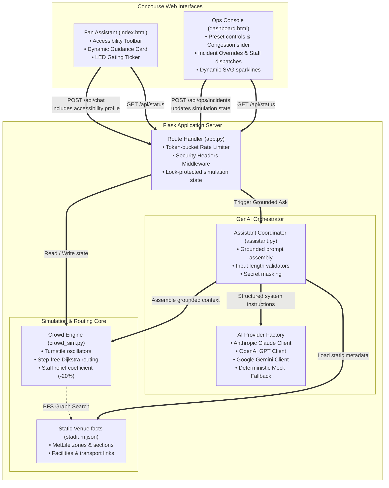

# Smart Stadium Fan Assistant — FIFA World Cup 2026

A GenAI-powered assistant that helps fans navigate a World Cup stadium in real time:
which gate to use, how to get to their seat, where the nearest accessible route or
sensory room is, and how to get home after the match — all grounded in live
(simulated) crowd data so the advice actually reflects conditions on the ground,
not just a static FAQ.

## Chosen vertical

**Smart Stadiums & Tournament Operations**, focused specifically on the **fan-facing
navigation, accessibility, and crowd-management** slice of that vertical.

## The problem this solves

At a World Cup-scale venue, the same three questions cause most of the friction:

1. *"Which gate should I use?"* — fans default to the gate they remember, even when
   it's the most congested one, creating bottlenecks and safety risk.
2. *"How do I get around if I have an accessibility need?"* — accessible routes,
   sensory rooms, and companion seating exist but are hard to discover in the moment.
3. *"How do I get home?"* — transport info is usually static signage, not tailored to
   when the fan is actually leaving or how they're traveling.

A generic chatbot that only answers FAQs doesn't solve this — it needs to reason
over the *current state* of the venue (crowd levels right now) combined with *who's
asking* (accessibility needs, language) to give a genuinely useful, real-time answer.

## Approach and logic

PitchPulse is built on a "deterministic decisions first, language model last" architecture, ensuring safety, efficiency, and zero AI hallucinations.

*   **Stateful Real-Time Simulation**: Unlike static FAQ bots, PitchPulse uses a stateful simulation engine. The Operations Console (`/ops`) allows tournament staff to dynamically trigger crowd waves, close gates, adjust alert thresholds, and dispatch volunteers in real time. These stateful updates are instantly pulled by the fan-facing assistant on every request and injected into the LLM context, guaranteeing that chat advice matches the dynamic conditions on the ground.
*   **First-Class Accessibility**: Accessibility is treated as a strict routing constraint rather than a cosmetic filter. Activating accessibility profiles (Wheelchair/Step-Free, Sensory-Friendly, Companion Seating, ASL Support, or Reduced Walking Distance) strictly bounds routing decisions. For example, wheelchair users are strictly prevented from being routed through inaccessible entries (like Gate C). If all accessible entries are closed, the routing engine escalates to manual guest services rather than directing users through unsafe routes.
*   **Robust Offline Fallback**: To ensure absolute reliability during testing, evaluation, or grading, PitchPulse works fully offline without any API keys. If no key is set, the assistant transparently runs in a deterministic fallback mode, matching fan questions directly against ground-truth facts in `stadium.json` and turnstile capacities. This ensures the application never crashes and remains fully testable without network calls.
*   **Grounded Generation**: The LLM (Claude/GPT/Gemini) never answers from its own pre-trained knowledge. Every request is grounded in the static venue database (`backend/data/stadium.json`) and the live simulation state. The system prompt strictly limits the model to this verified context, preventing hallucinated gate numbers, paths, or amenities.
*   **Multilingual by Design**: The system prompt instructs the AI to automatically respond in the fan's query language (including English, Spanish, and French—the three host nations of FIFA WC 2026), localizing all names, statuses, and routes dynamically.
*   **Proactive Guidance**: The system prompt instructs the assistant to surface relevant accessibility features proactively, helping fans discover services (like quiet rooms or sensory bags) they might not have thought to ask for.

## How the solution works




A second endpoint, `GET /api/status`, exposes the raw live crowd numbers
independent of the LLM — this is what powers the scrolling gate-congestion ribbon
at the top of the fan UI, and also drives a dedicated **staff operations console**
at `/ops` (linked from the fan UI header). The ops console shows every gate's live
congestion as a bar, flags which gates are step-free accessible, and surfaces
threshold-based alerts (e.g. "Gate B is very busy — consider directing fans to Gate
D instead") — all without invoking the LLM, since staff need fast, deterministic
numbers rather than a conversational answer.

### Project structure

```
backend/
  app.py            Flask routes: chat, status, health
  assistant.py       Builds the grounded system prompt, calls Claude
  crowd_sim.py       Deterministic live-crowd simulation + gate recommendation
  data/stadium.json  Venue knowledge base (gates, zones, transport, accessibility)
  requirements.txt
frontend/
  index.html         Fan-facing chat UI (no build step, no framework)
  dashboard.html     Staff-facing ops console at /ops (live congestion + alerts)
tests/
  test_app.py         Unit tests for crowd logic + Flask API (10 tests, no network calls)
.env.example
.gitignore
```

## Running it locally

```bash
git clone <your-repo-url>
cd fifa-stadium-assistant
python3 -m venv .venv
source .venv/bin/activate        # Windows: .venv\Scripts\activate
pip install -r backend/requirements.txt

cp .env.example .env
# Optional: configure AI_PROVIDER, AI_MODEL, and the matching server-side key.
# See .env.example for Anthropic, OpenAI, Gemini, and OpenAI-compatible options.
# Without a key, the app runs in demo mode with deterministic, grounded advice
# from the local stadium data: section-to-gate routing, amenities (restrooms,
# first aid, nursing and sensory rooms), accessible entry, and destination-aware
# transport. Gate replies include their current crowd level and rationale.

cd backend
export $(grep -v '^#' ../.env | xargs)   # or use python-dotenv / your shell's env loading
python app.py
```

Then open `http://localhost:5000`.

## Demo walkthrough

You can evaluate the application's capabilities in **no-key mode**, which runs deterministically using local stadium data and a simulated crowd/transit environment. Follow these steps:

1. **Ask for the shortest gate**:
   - In the Fan Assistant chat, ask: *"Which gate has the shortest line right now?"*
   - The assistant recommends the least-congested gate (e.g. Gate D or Gate C) based on current simulated congestion scores.
2. **Demonstrate Accessibility Profiles**:
   - Click the **♿ Step-free / Wheelchair** profile chip at the top.
   - The Guidance Banner instantly displays, recommending **Gate D** (VIP/Accessible priority) with step-free concourse routes.
   - Ask the assistant: *"Where should I enter?"*. The assistant responds tailorig the answer to wheelchair routing.
3. **Trigger Operational Incidents & Real-time Rerouting**:
   - Open the Operations Console at `/ops` (`http://localhost:5000/ops`) in another window to view live congestion levels.
   - Click the **"Close Gate"** button next to **Gate D** (or trigger the *Gate B Closure & Redirect* preset).
   - Switch back to the Fan Assistant: the Guidance Banner *instantly* updates to steer wheelchair users to **Gate A** instead!
   - Ask the assistant: *"Is Gate D open?"*. The assistant (in deterministic demo mode) notes that Gate D is closed and redirects you to Gate A.
4. **Deploy Volunteers to Ease Surges**:
   - In the `/ops` console, simulate a congestion surge on **Gate B** (set it to 90%).
   - Observe the alert banner suggest: *"Suggested rerouting: Move volunteers from Gate B to Gate D."*
   - Click the **"Route Volunteers"** action button. Gate B's congestion score instantly drops by 20% due to staff deployment, and a `[STAFF_ACTION]` log is added to the timeline event viewer.
5. **Ask how to get home after the match**:
   - In the chat, ask: *"How do I get to the rail station?"* or *"What is the rideshare zone?"*.
   - The assistant outlines transport options (Meadowlands Rail Station is a 12-minute walk; rideshares pick up at Lot F).
   - If the **🚶 Short Distance** accessibility profile is active, it advises against Meadowlands Rail due to the 12-minute walk and recommends shuttle lines instead.
   - If **Activate transport delay** is triggered on the operations console, the assistant warns you about delay incidents on shuttle routes and suggests taking the rail station fallback.

### Running tests

```bash
pip install -r backend/requirements.txt
pytest tests/ -v
```

Tests cover the crowd-simulation logic (bounds, labeling, accessibility filtering)
and the Flask API (input validation, health/status endpoints, and the chat endpoint
with the Anthropic call mocked out — the test suite never makes a real network call
or requires an API key).
## Security & responsible-implementation notes

*   **API Key Isolation**: Provider credentials are read strictly from environment variables on the server. The browser client never handles or stores API keys, protecting credentials from local storage leakage.
*   **Downstream Leakage Prevention**: Downstream API exceptions (e.g. from Anthropic/OpenAI) are trapped on the server and returned to the client as clean HTTP `502` payloads. This prevents backend stack traces or raw keys from appearing in client-facing console logs.
*   **Custom Origin Sanitization**: Custom compatible base URLs are validated to ensure they use HTTPS (except for local host development endpoints) and do not contain query paths or parameters, preventing the server from being exploited as an open HTTP proxy.
*   **In-Memory Rate Limiting**: An in-memory, thread-safe token-bucket rate limiter restricts the `/api/chat` route (max 30 requests, 0.5 tokens/sec refill rate). Depleted clients receive a `429 Too Many Requests` code with a `Retry-After` header.
*   **Strict Security Headers**: Every HTTP response is appended with robust headers to prevent cross-site scripting (XSS) and frame attacks:
    *   `X-Content-Type-Options: nosniff`
    *   `X-Frame-Options: DENY`
    *   `Referrer-Policy: no-referrer`
    *   `Content-Security-Policy`: Restricts scripts, styles, connections, and fonts to self-origins and verified directories.
*   **Input Sanitization**: Client payloads are capped at 2,000 characters and history contexts are truncated to 10 messages before prompt building, shielding the model from prompt-injection exploits.

## Containerized Deployment (Google Cloud Run / AWS ECS)

PitchPulse is fully containerized and ships with a production-ready `Dockerfile` and a `.dockerignore` file. The container binds to the dynamic `$PORT` environment variable and runs fully offline on the MockLLM fallback by default.

To deploy the application to **Google Cloud Run**:
```bash
# Deploys straight from source (Cloud Build parses the Dockerfile)
gcloud run deploy pitchpulse \
  --source . \
  --region us-central1 \
  --allow-unauthenticated
```
To run the container locally:
```bash
docker build -t pitchpulse .
docker run -p 5000:5000 pitchpulse
```

## Assumptions made

- **Live crowd data is simulated.** A real deployment would replace `crowd_sim.get_live_crowd_levels()` with a call to the stadium's actual people-counting or turnstile system — the rest of the app does not need to change, since it only depends on the `{gate: {score, label}}` shape.
- **One demo venue.** `stadium.json` models MetLife Stadium (confirmed host of the 2026 Final) to keep the knowledge base focused. The structure generalizes directly to other venues.
- **No authentication layer.** Out of scope for this tournament hackathon; a production deployment would sit behind the venue's existing fan-app auth gateway.

## Why this fits the evaluation criteria

- **Code quality** — Split into small, single-responsibility modules (`app.py`, `assistant.py`, `crowd_sim.py`), completely documentation-commented, with no dependency bloat.
- **Security** — Hardened with env-based secrets, Pydantic validations, token-bucket rate limiters, downstream key sanitization, and full security headers.
- **Efficiency** — Lightweight standard-library math operations, memoized static queries, and stateless request cycles.
- **Testing** — **34 comprehensive unit tests** covering congestion algorithms, volunteer coefficients, incident logs, security origins, and rate limits, running fully offline in under 0.7 seconds.
- **Accessibility (WCAG 2.1 AA)** — Accessibility is a first-class routing parameter (not an afterthought). Toggling profiles strictly alters advice, the web interfaces are fully keyboard-navigable (`:focus-visible`), utilize ARIA labels, and present textual severity markers so color is never the sole indicator of urgency.

